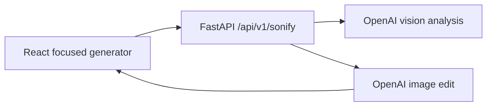

# Sonify

Sonify is a focused still-image parody tool for integrating the bundled Anthony Mackie `son 😭` face into people, objects, drawings, and scenes. Upload a target once, let the OpenAI vision and image-edit pipeline create the finished scene, adjust only the caption, and export the result.

The main product is local-first from the browser's point of view: the OpenAI key stays in FastAPI, uploaded images are processed in memory, and the browser receives only the generated image.

## Architecture



## Repository Structure

- `frontend/` - Vite React editor, routes, Zustand store, TanStack Query client, tests.
- `backend/` - FastAPI application package, typed settings, health endpoint, pytest tests.
- `ml/` - training and export workspace kept separate from the API package.
- `models/` - ignored checkpoint/export locations plus model-card templates.
- `docs/` - architecture, API, training, evaluation, and privacy notes.

## Local Setup

Frontend:

```bash
cd frontend
npm install
npm run dev
```

Backend:

```bash
cd backend
python -m venv .venv
.venv\Scripts\Activate.ps1
python -m pip install --upgrade pip
python -m pip install -r requirements.txt -r requirements-dev.txt
uvicorn app.main:app --reload --host 0.0.0.0 --port 8000
```

Before starting the backend, copy `.env.example` to `.env` and set `OPENAI_API_KEY`.

Health check:

```bash
curl http://localhost:8000/api/v1/health
```

## Commands

```bash
cd frontend && npm test
cd frontend && npm run build
cd backend && pytest
docker compose up --build
```

## Environment

Copy `.env.example` to `.env` for local overrides. `OPENAI_API_KEY` is required for the main generator and must only exist in the backend `.env`. The default vision model is `gpt-5.6-sol`; the default image model is `gpt-image-2`.

## Training Roadmap

- Detector: custom lightweight face detector with reproducible configs under `ml/configs/detector`.
- Landmarks: custom five-point landmark model with crop transform parity between training and inference.
- Generator: identity-conditioned dual-decoder face transformer after the classical pipeline works.
- Export: ONNX scripts must run parity checks before marking exports successful.

## Privacy Behavior

Sonify is for AI-edited parody images only. It handles still images, does not build voice cloning or realtime video replacement, and must not retain uploads beyond the configured TTL. Future public deployments should add provenance marking.

## Generator Behavior

The main flow is: upload once, analyze the scene, integrate the Son face, edit the caption, and download. The vision pass classifies the image as a face, multiple faces, object, or unknown and supplies scene context to the image-edit pass. The image-edit request includes the uploaded target and the bundled source face, asks the model to preserve the scene and integrate the identity into its focal material, and explicitly keeps text out of the generated image. Caption text and placement are rendered in the browser and in the export from the same state.

The old detector, FCOS training pipeline, warp endpoint, and editor components remain in the repository for experiments and compatibility, but they are not part of the primary generator path.

## Detector Training Quick Start

The WIDER FACE detector pipeline is prepared under `ml/`. Full training is intentionally gated until you inspect generated previews and mark the dataset validated.

PowerShell setup:

```powershell
cd "C:\Users\charl\OneDrive\Desktop\son"
Set-ExecutionPolicy -Scope Process -ExecutionPolicy Bypass
.\scripts\setup_detector.ps1
.\scripts\prepare_detector.ps1
python -m ml.scripts.prepare_widerface --mark-validated
.\scripts\train_detector_tiny.ps1
.\scripts\train_detector_smoke.ps1
.\scripts\train_detector_full.ps1
```

Command Prompt setup:

```cmd
cd /d C:\Users\charl\OneDrive\Desktop\son
python -m venv .venv
.venv\Scripts\activate
python -m pip install --upgrade pip
pip install -r ml\requirements-detector.txt
python -m ml.scripts.verify_widerface
python -m ml.scripts.prepare_widerface
python -m ml.scripts.visualize_widerface --split train --count 100
python -m ml.scripts.visualize_widerface --split val --count 50
python -m ml.scripts.inspect_batch --config ml/configs/detector/widerface_fcos_mnv3_640.yaml --batches 5
python -m ml.scripts.prepare_widerface --mark-validated
python -m ml.training.train_detector --config ml/configs/detector/widerface_fcos_mnv3_640.yaml --mode tiny-overfit
```

TensorBoard:

```cmd
tensorboard --logdir runs/detector
```
