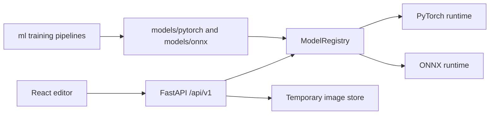

# Sonify

Sonify is a still-image parody meme generator for the `son 😭` format. The first milestone creates the runnable project foundation: a Vite + React + TypeScript editor shell, a FastAPI backend with typed configuration and a health endpoint, and a separate ML workspace for future custom training.

The project is intentionally staged. This commit does not claim to include trained custom face models yet. The app reports unavailable checkpoints honestly until later milestones add the detector, landmarks, classical warp pipeline, and neural transformer.

## Architecture



## Repository Structure

- `frontend/` - Vite React editor, routes, Zustand store, TanStack Query client, tests.
- `backend/` - FastAPI application package, typed settings, health endpoint, pytest tests.
- `ml/` - training and export workspace kept separate from the API package.
- `models/` - ignored checkpoint/export locations plus model-card templates.
- `docs/` - architecture, API, training, evaluation, and privacy notes.

## Local Setup

Frontend:

```bash
cd frontend
npm install
npm run dev
```

Backend:

```bash
cd backend
python -m venv .venv
.venv\Scripts\Activate.ps1
python -m pip install --upgrade pip
python -m pip install -r requirements.txt -r requirements-dev.txt
uvicorn app.main:app --reload --host 0.0.0.0 --port 8000
```

Health check:

```bash
curl http://localhost:8000/api/v1/health
```

## Commands

```bash
cd frontend && npm test
cd frontend && npm run build
cd backend && pytest
docker compose up --build
```

## Environment

Copy `.env.example` to `.env` for local overrides. `MODEL_DEVICE=auto` chooses CUDA when PyTorch can see it and falls back to CPU. `MODEL_RUNTIME` accepts `pytorch` and `onnx`.

## Training Roadmap

- Detector: custom lightweight face detector with reproducible configs under `ml/configs/detector`.
- Landmarks: custom five-point landmark model with crop transform parity between training and inference.
- Generator: identity-conditioned dual-decoder face transformer after the classical pipeline works.
- Export: ONNX scripts must run parity checks before marking exports successful.

## Privacy Behavior

Sonify is for AI-edited parody images only. It handles still images, does not build voice cloning or realtime video replacement, and must not retain uploads beyond the configured TTL. Future public deployments should add provenance marking.

## Known Limitations

Milestone 1 is a foundation. Upload, detection, landmark inference, classical warping, and final image export are intentionally scheduled for later milestones.

## Detector Training Quick Start

The WIDER FACE detector pipeline is prepared under `ml/`. Full training is intentionally gated until you inspect generated previews and mark the dataset validated.

PowerShell setup:

```powershell
cd "C:\Users\charl\OneDrive\Desktop\son"
Set-ExecutionPolicy -Scope Process -ExecutionPolicy Bypass
.\scripts\setup_detector.ps1
.\scripts\prepare_detector.ps1
python -m ml.scripts.prepare_widerface --mark-validated
.\scripts\train_detector_tiny.ps1
.\scripts\train_detector_smoke.ps1
.\scripts\train_detector_full.ps1
```

Command Prompt setup:

```cmd
cd /d C:\Users\charl\OneDrive\Desktop\son
python -m venv .venv
.venv\Scripts\activate
python -m pip install --upgrade pip
pip install -r ml\requirements-detector.txt
python -m ml.scripts.verify_widerface
python -m ml.scripts.prepare_widerface
python -m ml.scripts.visualize_widerface --split train --count 100
python -m ml.scripts.visualize_widerface --split val --count 50
python -m ml.scripts.inspect_batch --config ml/configs/detector/widerface_fcos_mnv3_640.yaml --batches 5
python -m ml.scripts.prepare_widerface --mark-validated
python -m ml.training.train_detector --config ml/configs/detector/widerface_fcos_mnv3_640.yaml --mode tiny-overfit
```

TensorBoard:

```cmd
tensorboard --logdir runs/detector
```
